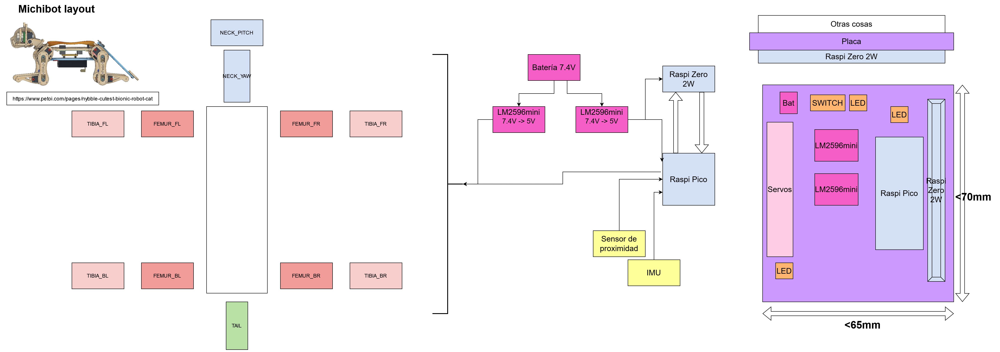

# michibot

Michi (cat) intentionally design for work with a Raspberry Pi Pico + micropython. 

## Ref
- <https://www.petoi.com/pages/nybble-cutest-bionic-robot-cat>
- <https://www.thingiverse.com/thing:4015171/files>

Ideas & examples may found here <https://github.com/raspberrypi/pico-examples>

# Materials
- Raspberry Pi Pico
- Servo SG90 (9g ones)
- Raspberry Pi Zero 2W

# Brainstorming/layout/PCBdesign

